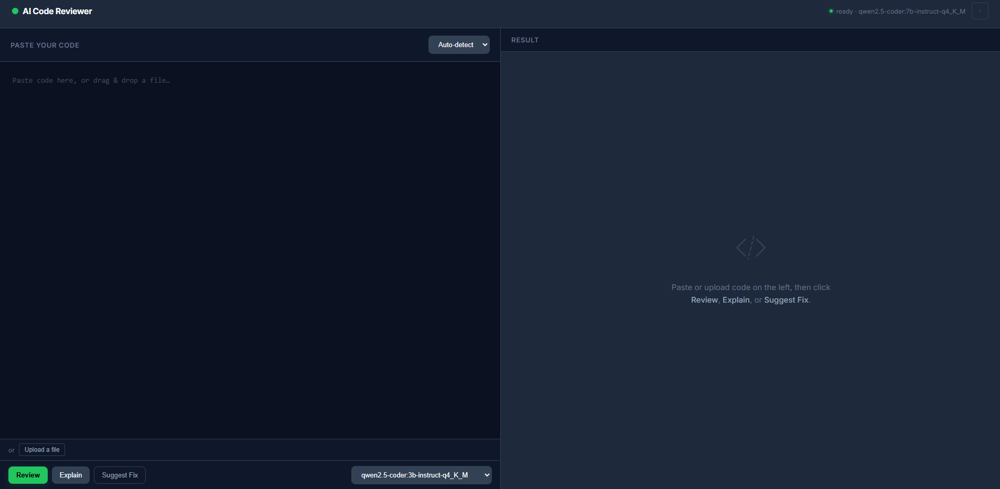
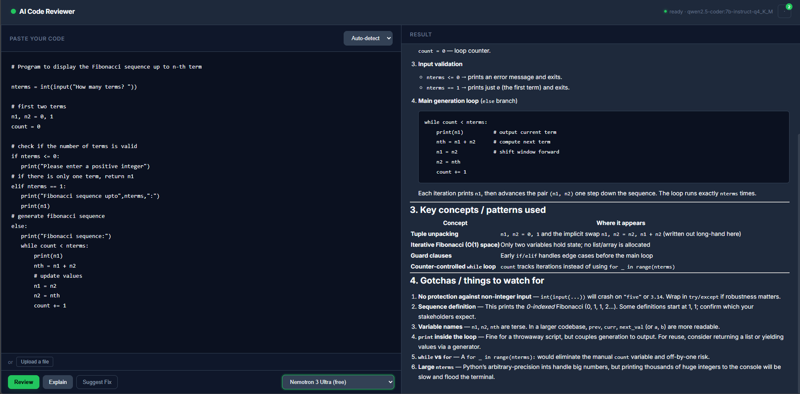

# AI Code Reviewer

A self-hosted code review / code explainer tool. Runs entirely on open-weight
models — either **locally and free forever via [Ollama](https://ollama.com)**,
or optionally via **free-tier models on [OpenRouter](https://openrouter.ai)**
when you want cloud speed without paying anything. No mandatory API keys, no
per-token billing unless you choose to add it yourself.




<!--
## Screenshots
Add 2-3 screenshots here once you have them, e.g.:


-->

---

## 1. What it does

- **Review**: pastes code → structured bugs/security/performance/style review with a quality score.
- **Explain**: plain-language walkthrough of what unfamiliar code does.
- **Suggest Fix**: returns corrected code and shows a diff against your original.
- Works with **two interchangeable model providers**:
  - **Ollama** (local, CPU or GPU, genuinely $0, your code never leaves your machine)
  - **OpenRouter** (cloud, optional, several models free, faster than CPU inference)
- File upload with auto language detection, in-session review history, and a light/dark theme toggle.

---

## 2. Hardware reality check (if running Ollama locally)

Everything in the Ollama path runs on **CPU** unless you have a CUDA GPU. On a
typical ultrabook CPU (4-8 threads, no dedicated GPU) expect roughly
**3-8 tokens/second** with a quantized 7B model — fine for a review you read
afterward, not instant chat speed. 16GB RAM comfortably fits one quantized 7B
model (~4-5GB resident) alongside the OS and this app.

### Model recommendation (Ollama)

| Model | Size (Q4_K_M) | Notes |
|---|---|---|
| `qwen2.5-coder:7b-instruct-q4_K_M` | ~4.7GB | **Best default.** Strong code understanding. |
| `deepseek-coder:6.7b-instruct-q4_K_M` | ~4.2GB | Close second, slightly faster. |
| `codellama:7b-instruct-q4_K_M` | ~4.1GB | Solid, slightly older. |
| `qwen2.5-coder:3b-instruct-q4_K_M` | ~2GB | Use if 7B feels too slow. |
| `starcoder2:7b-q4_K_M` | ~4.4GB | StarCoder-family option. |

If your connection is unstable, large pulls (4-5GB) can stall and retry
mid-download — that's normal; Ollama retries automatically. A wired
connection or pausing other downloads helps.

### Free models (OpenRouter) — no download, no local compute needed

These four are pre-wired into this project. Enabling them needs **zero code
changes** — just add one line to `.env` (see section 4).

| Model | Notes |
|---|---|
| `mistralai/mistral-7b-instruct:free` | **Default when OpenRouter is selected.** Strong general-purpose coding model, high real-world usage. |
| `cohere/north-mini-code:free` | Small, fast coding model. |
| `nvidia/nemotron-3-ultra-550b-a55b:free` | Large MoE model, good for deeper reasoning on bigger snippets. |
| `openrouter/free` | Auto-router across whatever free models are currently available. |

**Caveats worth knowing:**
- OpenRouter's free models share one rate limit pool (~20 requests/minute,
  higher daily cap if you add $10 of credit to your account — that's used as
  an anti-abuse signal, not a charge against you).
- Free-tier model availability rotates over time. If one of the four above
  stops working, check [openrouter.ai/models](https://openrouter.ai/models)
  for current free options and update `OPENROUTER_FREE_MODELS` in
  `backend/settings.py`.
- Don't route sensitive/proprietary code through any cloud provider if that
  matters to you — Ollama keeps everything local.

---

## 3. What's in this project

```
ai-code-reviewer/
├── backend/
│   ├── main.py                 # FastAPI routes, provider routing, serves the frontend
│   ├── ollama_client.py        # streaming client for local Ollama
│   ├── openrouter_client.py    # streaming client for OpenRouter's free models
│   ├── prompts.py              # review / explain / fix prompt templates
│   ├── settings.py             # env-based configuration + curated free-model list
│   ├── requirements.txt
│   └── Dockerfile
├── frontend/
│   └── index.html              # single-page UI: provider/model toggle, upload, history, diff view
├── tests/
│   └── test_api.py             # pytest suite, mocks both providers
├── .github/workflows/ci.yml    # lint (ruff) + test + docker build on every push
├── ruff.toml                   # pins first-party import detection so lint is consistent
│                                # whether run locally (`cd backend && ruff check .`) or
│                                # from CI (`ruff check backend` from repo root)
├── docker-compose.yml          # one-command full stack (Ollama + backend)
├── ollama-entrypoint.sh        # auto-pulls the model on first container start
├── .env.example
└── README.md
```

**Architecture:** browser → FastAPI backend → Ollama *or* OpenRouter
(your choice per request) → streamed Server-Sent Events back to the browser,
rendered incrementally as Markdown.

---

## 4. Setup

### Option A — Docker (recommended, one command)

Requires [Docker Desktop](https://docs.docker.com/get-docker/) running.

```bash
git clone <your-repo-url>
cd ai-code-reviewer
docker compose up --build
```

First run pulls the Ollama image and the model (~4-5GB) — can take a while.
Then open **http://localhost:8000**.

```bash
# Use a smaller/faster model:
MODEL_NAME=qwen2.5-coder:3b-instruct-q4_K_M docker compose up --build
```

Stop with `docker compose down` (add `-v` to also delete the downloaded
model and free disk space).

**If Docker Desktop won't start** ("unable to get image... dockerDesktopLinuxEngine"
on Windows): open Docker Desktop itself and wait for the whale icon to go
idle before retrying — the CLI works independently of the engine being up.

### Option B — Run natively (no Docker)

**Install Ollama:**
```bash
curl -fsSL https://ollama.com/install.sh | sh
# Windows/macOS: download the installer from ollama.com instead
```

**Pull a model:**
```bash
ollama pull qwen2.5-coder:7b-instruct-q4_K_M
```

**Confirm it works:**
```bash
ollama run qwen2.5-coder:7b-instruct-q4_K_M "Explain what a race condition is in one sentence."
```

**Set up the backend — use Python 3.11, 3.12, or 3.13, not the newest
pre-release Python.** A brand-new Python version (e.g. 3.14) often has no
prebuilt wheel yet for `pydantic-core`, which then tries to compile from
Rust and fails without Visual Studio's C++ build tools installed. If you hit
that error, install 3.12 alongside your existing Python
(`winget install --id Python.Python.3.12 -e` on Windows) and use `py -3.12`
to target it specifically:

```bash
cd backend
py -3.12 -m venv venv          # or: python3.12 -m venv venv  (macOS/Linux)
venv\Scripts\activate          # macOS/Linux: source venv/bin/activate
pip install -r requirements.txt
copy ..\.env.example .env      # macOS/Linux: cp ../.env.example .env
uvicorn main:app --reload --port 8000
```

Open **http://localhost:8000**.

> **PowerShell tip:** run each setup command on its own line and press Enter
> before typing the next one. Pasting several commands as one block (e.g.
> `python -m venv venv venv\Scripts\activate pip install ...`) gets parsed
> as a single invalid command.

---

## 5. Enabling OpenRouter's free models (optional)

No code changes needed — this is pre-wired. Just:

1. Get a free API key at [openrouter.ai/keys](https://openrouter.ai/keys)
   (no credit card required to create one).
2. Add it to `backend/.env`:
   ```
   OPENROUTER_API_KEY=sk-or-v1-your-actual-key-here
   ```
3. Restart the backend (`.env` is only read at startup).

The provider toggle in the UI will now offer "OpenRouter" alongside "Local
(Ollama)", pre-populated with the four curated free models from section 2.
If you don't set this key, the OpenRouter option simply stays hidden/disabled
— Ollama keeps working exactly as before.

---

## 6. Using it

1. Paste code, or drag-and-drop / upload a file (language auto-detects from the extension).
2. Choose a provider (Ollama / OpenRouter) and model from the dropdowns.
3. Click **Review**, **Explain**, or **Suggest Fix**.
4. Output streams in as Markdown; **Suggest Fix** additionally renders a diff against your original code.
5. Past results in this session appear in the history panel — click one to restore it without re-calling the API.
6. Toggle light/dark theme from the header; your choice is remembered via `localStorage`.

### API reference

```
POST /api/review      { "code": "...", "language": "python", "model": null, "provider": null }  -> SSE stream
POST /api/explain     { "code": "...", "language": "python", "model": null, "provider": null }  -> SSE stream
POST /api/fix         { "code": "...", "language": "python", "model": null, "provider": null }  -> SSE stream (corrected code)
GET  /api/models?provider=ollama|openrouter                                                      -> { "models": [...] }
GET  /api/providers                                                                               -> { "ollama": bool, "openrouter": bool }
GET  /api/health                                                                                  -> { "status", "ollama_reachable", "default_model", "openrouter_available" }
```

`model` and `provider` are optional — omit both to use Ollama with the server's configured default model.

---

## 7. Testing & CI

```bash
pip install pytest ruff
ruff check backend              # from the repo root — matches CI exactly
pytest tests/ -v
```

`ruff.toml` at the repo root pins first-party import detection so this
command gives identical results whether run from the repo root (as CI does)
or from inside `backend/` during local dev. Without it, ruff's import-sort
rule can disagree with itself depending on your current directory — if you
ever see `ruff check backend` and `ruff check .` from inside `backend/`
disagree, check that `ruff.toml` still has `src = ["backend"]`.

GitHub Actions (`.github/workflows/ci.yml`) runs lint + tests + a Docker
build check on every push/PR, using mocked providers — no real Ollama or
OpenRouter calls needed.

---

## 8. Deployment: the honest version

Running a 7B model needs real, sustained CPU/RAM — most free serverless
hosts won't give you that indefinitely. Real free options, in order of how
"production" they feel:

### Option 1 — Your own machine + a free tunnel (truly $0, easiest)
```bash
docker compose up -d
cloudflared tunnel --url http://localhost:8000
```
Free stable HTTPS URL, no port forwarding. Only "up" while your machine is on.

### Option 2 — Oracle Cloud "Always Free" ARM VM (free forever, real 24/7 uptime)
Oracle's free tier includes an Ampere ARM instance with up to 4 OCPUs and
24GB RAM (check current terms before committing — free-tier terms do
change). Ollama runs natively on ARM. Clone the repo and
`docker compose up -d --build` there for a genuinely always-on free deployment.

### Option 3 — Hugging Face Spaces (free CPU tier)
~16GB RAM / 2 vCPUs, sleeps after inactivity. Use the 3B Ollama model or
lean on OpenRouter's free models here instead, since local CPU is tighter.

### Option 4 — Skip local inference entirely, use OpenRouter only
If you deploy to any lightweight free web host (Render, Railway, Fly.io free
tiers), you can run just the FastAPI backend with Ollama disabled and
OpenRouter as the only provider — no heavy local compute needed at all.
This trades "fully private, fully free forever" for "needs an OpenRouter key,
shares its rate limit, but deploys anywhere."

### What won't work for free
Most serverless/static hosts don't support long-lived processes or give
enough CPU/RAM for local model inference. If you outgrow the options above,
that's the point to consider a small VPS (~$5-6/month), not before.

### Production hardening checklist (do this before sharing a public link)
- Set `CORS_ORIGINS` to your actual frontend domain, not `*`.
- Put the backend behind a reverse proxy (Caddy or nginx) for free auto-TLS.
- Add IP-based rate limiting at the proxy layer.
- Add basic auth in front of `/api/models` and `/api/health` if you don't want them public.

---

## 9. Troubleshooting

| Symptom | Fix |
|---|---|
| `status: degraded` on `/api/health` | Ollama isn't reachable. Check it's running and `OLLAMA_HOST` matches. |
| `docker compose up` fails with `dockerDesktopLinuxEngine` error | Docker Desktop itself isn't running — open it and wait for the whale icon to go idle before retrying. |
| Model pull stalls / percentage jumps backward | Network instability causing chunk retries, not a bug. Try a wired connection, pause other downloads/VPN, or switch to a smaller model. |
| `pip install` fails trying to compile `pydantic-core` via Rust/Cargo | You're likely on a too-new Python (e.g. 3.14) with no prebuilt wheel yet. Install Python 3.12 (`winget install --id Python.Python.3.12 -e`) and recreate the venv with `py -3.12 -m venv venv`. |
| `ruff` / `pytest` "not recognized" | Your venv isn't activated in this terminal session — run `venv\Scripts\activate` first. |
| `ruff check backend` (CI) and `ruff check .` (local) disagree on import order | Make sure `ruff.toml` exists at the repo root with `src = ["backend"]`. |
| `rd /s /q venv` fails in PowerShell | That's CMD syntax. Use `Remove-Item -Recurse -Force venv` instead. |
| Out-of-memory / container killed | Running the 7B model alongside something else memory-hungry. Try the 3B model or close other apps. |
| OpenRouter requests fail with a rate-limit message | Expected — the free tier shares ~20 req/min across all free models. Wait a minute or switch to Ollama/a different free model. |

---

## 10. Extending this

- **GitHub Action / PR bot**: call `POST /api/review` from a workflow and post the response as a PR comment.
- **VS Code extension**: shell out to the same API from a keybinding-triggered command.
- **Diff-aware review**: accept a git diff instead of a full paste, and prompt the model to focus only on changed lines.
- **Multi-file context**: extend `CodeRequest` to accept multiple files for cross-file reasoning.
